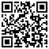
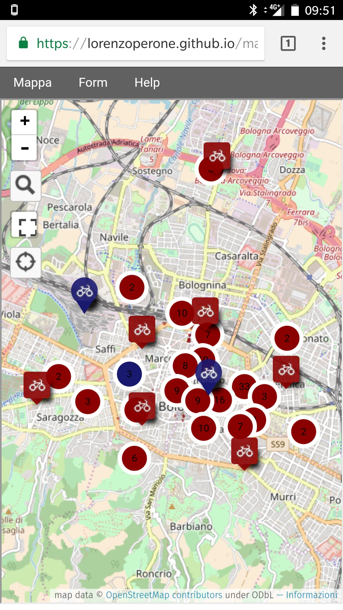
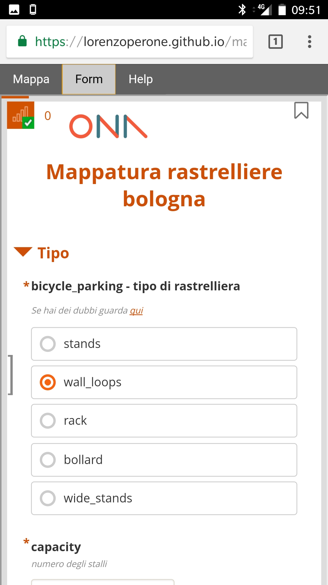

# Progetto per realizzare un tool per la mappatura delle rastrelliere bici del Comune di Bologna
Un ringraziamento per la collaborazione alla realizzazione e configurazione degli strumenti qui citati ad Andrea Borruso (@aburruso) e Paolo Frizzera (@geofriz).

### Link utili:

1. [Documento del comune di Bologna che descrive il progetto](https://docs.google.com/document/d/1pc8odVBJqvMSAJLq8SLGy7VpzNISlrFTlIiD2KX0zhs/edit#)
2. [Mappa fatta dal Comune di Bologna con i dati delle rastrelliere georeferenziate via geocoging](https://umap.openstreetmap.fr/ru/map/rastrelliere-per-il-parcheggio-delle-biciclette-a-_26587#17/44.49602/11.34108)
3. [Form ONA](https://enketo.ona.io/x/#YJWZ)
4. [Backend ONA](https://ona.io/lorenzo_perone/50895/271675#/overview)
5. [Editor del form ONA](https://forms.ona.io/#/forms/a7ZXtDQPDF3WfSvAxctedV/edit)
6. [Query Overpass per estrarre le rastrelliere](https://overpass-turbo.eu/s/uaP)
7. [GIST per pubblicare questo documento](https://github.com/lorenzoperone/restrelliere_bo)
8. [Mappa su Umap](https://github.com/lorenzoperone/restrelliere_bo)
9. [Form su ONA](https://enketo.ona.io/x/#YJWZ)
10. [Backend di consultazione dei dati del form](https://ona.io/lorenzo_perone/50895/271675#/overview)
11. [Pagina web per il rilievo](http://bit.ly/mappa_rastrelliere)

### Le componenti necessarie, per l'utilizzo da mobile, sono:

### **1.** Un sistema che estragga dinamicamente le rastrelliere da OSM via Overpass Turbo, le rastrelliere sono presenti sia come nodo che come way, l'area di riferimento è quella del comune di Bologna, ho realizzato un semplice boundingbox.

```
/*
This has been generated by the overpass-turbo wizard.
The original search was:
“amenity=bicycle_parking”
*/
[out:json][timeout:25];
// gather results
(
  // query part for: “amenity=bicycle_parking”
  node["amenity"="bicycle_parking"]({{bbox}});
  way["amenity"="bicycle_parking"]({{bbox}});
  relation["amenity"="bicycle_parking"]({{bbox}});
);
// print results
out body;
>;
out skel qt;
```
l'url per ottenere i dati grezzi sempre aggiornati in formato **OSM** è

```
https://overpass-api.de/api/interpreter?data=%2F*%0AThis%20has%20been%20generated%20by%20the%20overpass-turbo%20wizard.%0AThe%20original%20search%20was%3A%0A%E2%80%9Camenity%3Dbicycle_parking%E2%80%9D%0A*%2F%0A%5Bout%3Ajson%5D%5Btimeout%3A25%5D%3B%0A%2F%2F%20gather%20results%0A%28%0A%20%20%2F%2F%20query%20part%20for%3A%20%E2%80%9Camenity%3Dbicycle_parking%E2%80%9D%0A%20%20node%5B%22amenity%22%3D%22bicycle_parking%22%5D%2844.43304438224645%2C11.265792846679688%2C44.54631910686967%2C11.424236297607422%29%3B%0A%20%20way%5B%22amenity%22%3D%22bicycle_parking%22%5D%2844.43304438224645%2C11.265792846679688%2C44.54631910686967%2C11.424236297607422%29%3B%0A%20%20relation%5B%22amenity%22%3D%22bicycle_parking%22%5D%2844.43304438224645%2C11.265792846679688%2C44.54631910686967%2C11.424236297607422%29%3B%0A%29%3B%0A%2F%2F%20print%20results%0Aout%20body%3B%0A%3E%3B%0Aout%20skel%20qt%3B
```

### **2.** Un form ONA per inserire i dati sulle rastrelliere

Il form realizzato è [questo](https://enketo.ona.io/x/#YJWZ) i dati raccolti dal form possono essere liberamente visualizzati e scaricati, anche su mappa, a [questo](https://ona.io/lorenzo_perone/50895/271675#/overview) indirizzo.

I campi da inserire nel form sono un sottoinsiema dei tag proposti per [**amenity=bicycle_parking**](https://wiki.openstreetmap.org/wiki/Tag:amenity%3Dbicycle_parking):

* [**bicycle_parking**](https://wiki.openstreetmap.org/wiki/IT:Key:bicycle_parking): valore tag **stands**, **wall_loops**, **rack**, **bollard**, **wide_stands**

|**Key**|**Valore**|**Commento**|**Immagine**| 
|--------------------|-----------------|------------------------------------------------------------------------------------------------------------------------------------------------------------------------------------------------------------------------------------------------------------------------------------------------------------------------------------------------------------------------------------------------------------------------------------------------------|------------------------------------------------------------------------------------------------------------------------------------------------------------------------------------------------------------------| 
|bicycle_parking|stands|Un pezzo di metallo ripiegato contro cui si può appoggiare una bicicletta nella sua interezza. Rende possibile legarci il telaio e una ruota. Sicurezza moderata. Quando questi sostegni sono rettangolari vengono a volte chiamate "staple racks" nell'America del Nord e "Sheffield stands" nel Regno Unito. Questo tag va utilizzato anche per i sostegni non rettangolari (ad esempio a forma tonda, a strana forma artistica , a forma di w).|| 
|bicycle_parking|wall_loops|Spesso considerati sarcasticamente dei "piega ruote" dai ciclisti. Spesso attaccati ad un muro o ad un terreno. Permette di legare solo la ruota anteriore (o la ruota posteriore) e solo la parte più anteriore o la parte bassa. Se viene applicata della forza, le ruote della bici possono venire danneggiate. Bassa sicurezza.||
|bicycle_parking|rack|Una rastrelliera è simile all'ancoraggio sopra, ma tipicamente più grande e contiene molte più biciclette. Una tipologia è una rastrelliera appendiabiti (foto a destra). In una tipologia inferiore manca il supporto laterale del tutto.||
|bicycle_parking|anchors|Semplicemente un ancoraggio fissato in un muro, per terra o su un masso. Bassa sicurezza.|| 
|bicycle_parking|bollard|A special kind of bollard designed for bike locking. Generally, the bike is locked to the central pole and "arms" of some sort prevent thieves from simply lifting the bike over the pole. If it doubles as a barrier, add barrier  (https://wiki.openstreetmap.org/wiki/IT:Key:barrier)=  bollard  (https://wiki.openstreetmap.org/wiki/Tag:barrier%3Dbollard).||
|bicycle_parking|wide_stands|Un tipo di sostegno migliore con un pezzo di metallo largo e ripiegato contro cui si può appoggiare una bicicletta nella sua interezza. È più largo di quello descritto con il valore precedente stand. Si può parcheggiare due biciclette sui due lati del sostegno senza che i manubri siano nel mezzo. Di solito sono più lunghi di un normale sostegno. Dal momento che ci sono due pezzi di metallo, c'è più spazio per legare la bicicletta.||

* **capacity**: numero di stalli (posti) disponibili
* **covered**: se coperta usare **yes** altrimenti **no**
* [**access**](https://wiki.openstreetmap.org/wiki/IT:Key:access): valore tag: **yes**, **private**, **customer**, **unknown**

|**Valore**|**Descrizione**|
|--------------------|-----------------|
|customer|Solo per i clienti dell'elemento|
|private|Solo su permesso del proprietario su base individuale. Da usare quando la strada è di proprietà privata (vietato l'accesso agli estranei). Sconsigliato per le "strade private" che sono invece accessibili a tutti, vi è solo un divieto di sosta per i non residenti.|
|yes|Il pubblico ha un diritto di accesso ufficiale, legalmente riconosciuto, ad es. una strada pubblica.|

* **name**: eventuale nome della struttura, ad esempio **Velostazione Dynamo**,

più i seguenti tag, non obbligatori

* **addr:city**
* **addr:street**
* **addr:housenumber**

a cui aggiungerei delle specifiche informazioni legate al progetto [MappamoBO](https://groups.google.com/forum/#!forum/mappiamobo) da inserire nel campo

* **note**: tra le possibili informazioni da inserire ci sono:

  * **stato manutentivo**
  * **note relative alla posizione**: ad esempio la rastrelliera presente in OSM non c'è o è in una posizione diversa, per praticità assumerei che se c'è una rastrelliera con caratteristiche comparabili (copertura, tipo, numero stalli) ad una distanza inferiore a 10 metri si assume che sia spostata e si inserisce la nota attraverso il **form** nella nuova posizione segnalando l'id osm di quella da spostare, se la distanza è maggiore si fanno due inserimenti procedendo così:

    * si compila un form mettendosi nella posizione in cui in OSM è segnata la rasprelliera e si inserisce nelle **note** **mancante**
    * si compila un nuovo form in corrispondenza della rastrelliera distante più di 10 metri e non presente in OSM con tutte le caratteristiche.

Il form, attraverso la connessione con Google Spreadsheet produce dinamicamente [questo](https://docs.google.com/spreadsheets/d/e/2PACX-1vSYnXyQB_U4S7h3oE8bhMwL6htG9TqjXPlmoaFVGUFjx_TMiGUYPv-2qj3K_cqV22fFNqbAwzEGg_ts/pub?gid=828269048&single=true&output=csv) csv.


### **3.** Una mappa UMAP che riporti i dati estratti da OSM via Overpass Turbo e quelli raccolti dal form ONA.

La mappa è a [questo](https://github.com/lorenzoperone/restrelliere_bo) indirizzo, contiene i dati estratti dinamicamente da OSM attraverso la query Overpass Turbo e i dati inseriti attraverso il **form**.
Perché i dati inseriti attraverso il **form** siano visualizzati in mappa bisogna attendere alcuni minuti, in genere tre o quattro.


### **4.** Una pagina web che permetta di visualizzare la mappa UMAP, form ONA e alcune indicazioni su come procedere al rilievo 
Abbiamo realizzato [questa](https://github.com/lorenzoperone/lorenzoperone.github.io/blob/master/mappiamobo.html) pagina accessibile a [questo](https://lorenzoperone.github.io/mappiamobo.html) indirizzo anche attraverso uno shorten url [http://bit.ly/mappa_rastrelliere](http://bit.ly/mappa_rastrelliere) utilizzabile attraverso questo Qrcode



la pagina web ha questo aspetto



attraverso i tab, cioè le scritte **Mappa**, **Form** e **Help** è possibile passare alle altre pagine, come ad esempio quella **Form**



e quella della documentazione la cui origine è [questo](https://github.com/lorenzoperone/restrelliere_bo/blob/master/how_to.md) file *mark down* nel repository.